# Song Queue Spinner

A web-based song queue spinner for streamers using StreamerSongList. Spin a wheel to randomly select songs from your queue!

**Note:** You need a StreamerSongList account to use this application. Sign up at [streamersonglist.com](https://www.streamersonglist.com) if you don't have one already.

## Using the Spinner

*(Complete the [Setup](#setup) section below first if you haven't already)*

1. Enter your StreamerSongList username
2. Click "SPIN" to randomly select a song from your queue
3. Select the toggle button in the bottom right to hide/show the wheel
4. Select the "Reset" button -left of toggle- to clear the played songs list and start fresh
5. Click the "Change" button to change the streamer name

## Setup

### Download

1. Click the green "Code" button on GitHub

   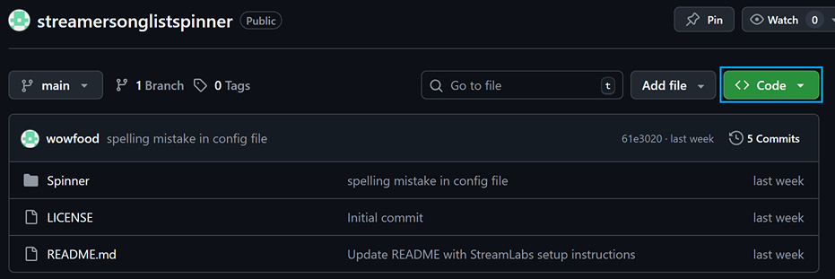

2. Select "Download ZIP"

   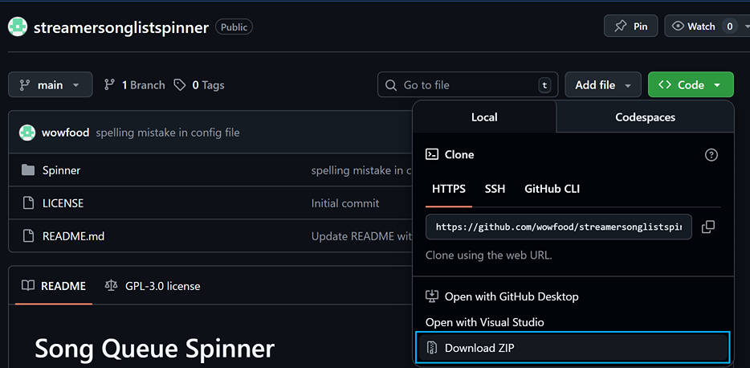

3. Extract the ZIP file to your desired location

### OBS Setup

1. Open OBS
2. In Sources, click the "+" button and select "Browser"

   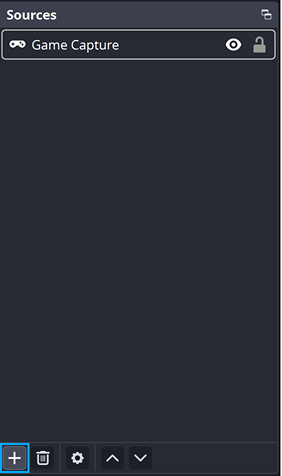   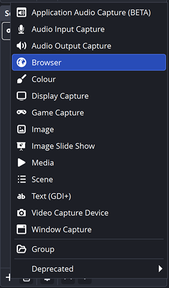

3. Check "Local file"

   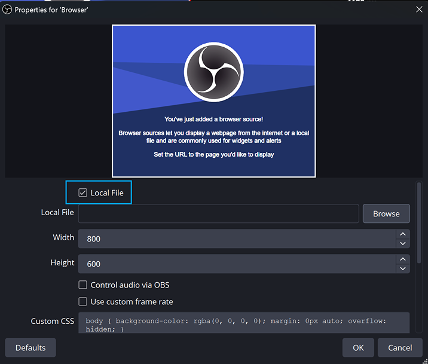

4. Navigate to the `SongSpinner.html` file

   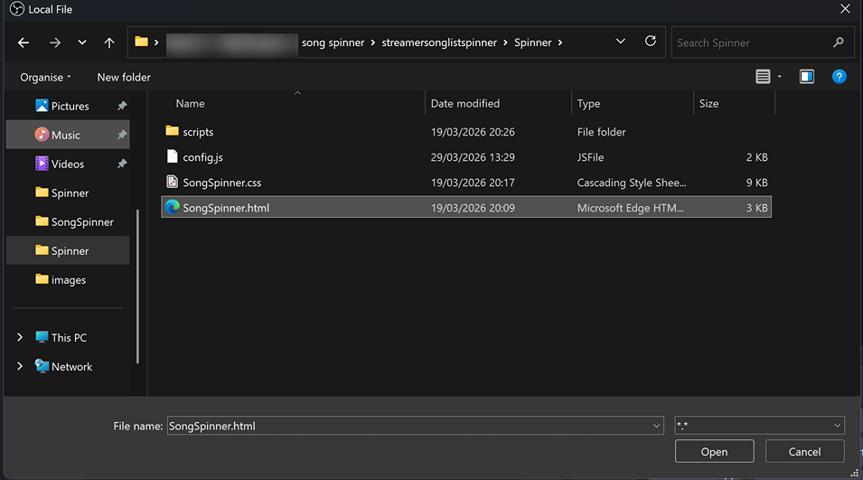

5. Set width and height to your stream resolution

   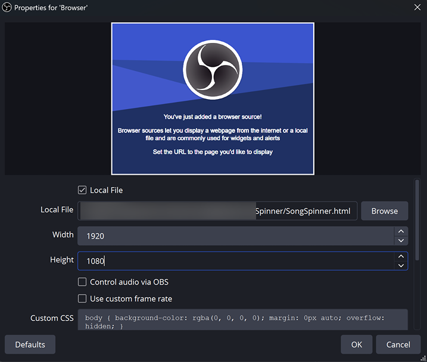

6. Delete the "Custom CSS" field

   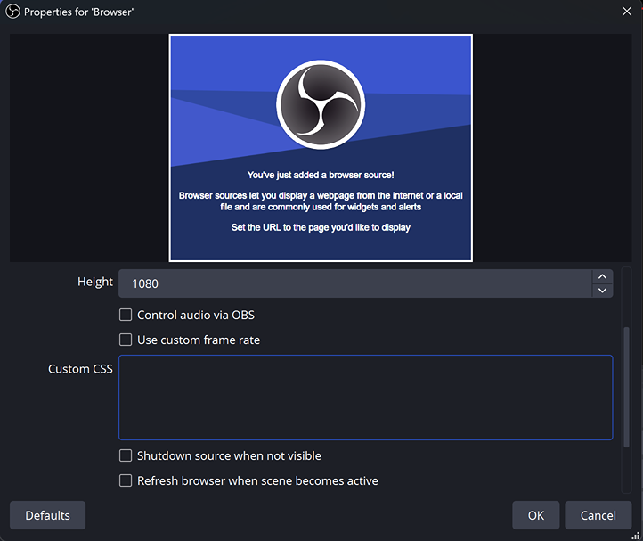

7. Click OK

**To interact with the spinner in OBS:**
- Right-click on the browser source and select "Interact"

   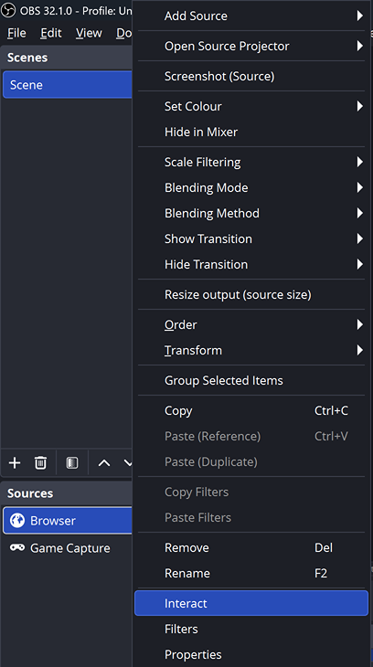

- This allows you to click buttons and interact with the spinner

#### Optional: OBS Dock Setup (Server Mode)

If you want the control buttons to be hidden on stream while remaining fully interactive, you can run the spinner as a local server and split it into a Browser Source (overlay, no buttons) and a Browser Dock (control panel, full UI).

1. Install [Node.js](https://nodejs.org/en/download) if you haven't already — download and run the installer, then restart your PC
2. Double-click `install.bat` in the spinner folder — this installs the required dependencies (only needed once)
3. Double-click `start.bat` to start the server
4. In OBS, add a **Browser Source** to your scene with URL `http://localhost:3000/` — this is the on-stream overlay (no buttons visible)
5. In OBS, go to **View > Docks > Custom Browser Docks**, add a dock with URL `http://localhost:3000/control` — this is your control panel, docked inside OBS
6. Use the dock to enter the streamer name and spin; the overlay updates automatically

> **Note:** `start.bat` must be running whenever you stream. The server only runs locally on your machine.

### StreamLabs Setup

1. In Editor, open your desired scene
2. In the sources section, click the "+" button and select "Browser Source"

   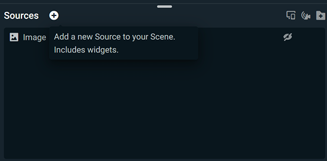

3. In browser source settings, check the "Local file" checkbox

   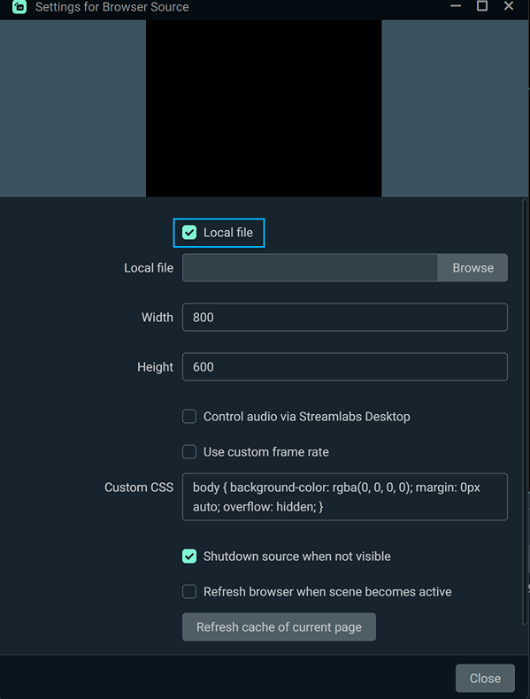

4. Set the path to the `SongSpinner.html` file

   

5. Adjust the width and height to match your stream resolution

   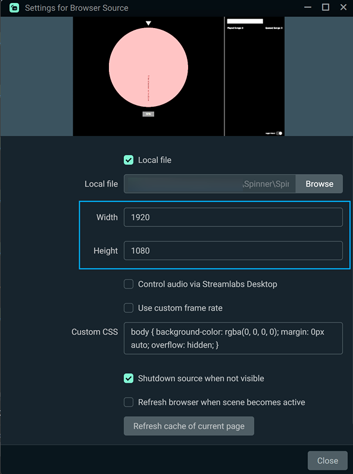

6. Remove any Custom CSS it generates automatically

   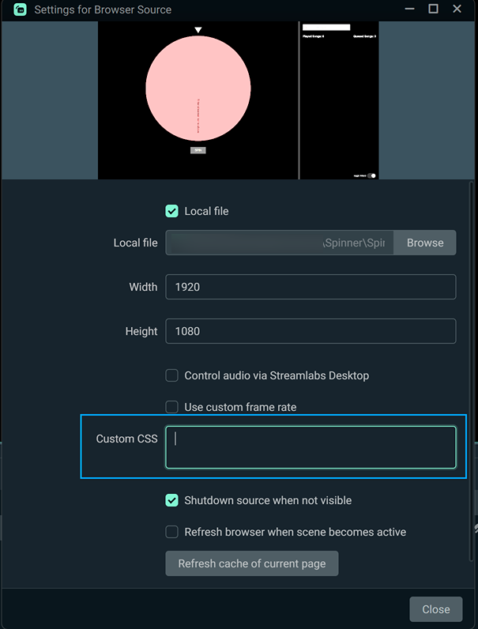

**To interact with the spinner in StreamLabs:**
- Right-click on the browser source and select "Interact"

   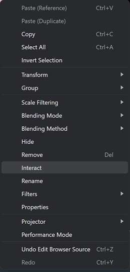

- This allows you to click buttons and interact with the spinner

#### Optional: StreamLabs Dock Setup (Server Mode)

StreamLabs also supports custom browser docks. Follow steps 1–3 of the OBS Dock Setup above to install Node.js and start the server, then:

1. In StreamLabs, go to **View > Custom Browser Docks** (or equivalent in your version)
2. Add a dock with URL `http://localhost:3000/control` — this is your control panel
3. Update your Browser Source URL from the local file path to `http://localhost:3000/` — this is the on-stream overlay

## Configuration

The application can be customized through the `config.js` file located in the `SongSpinner` directory (inside your extracted ZIP folder).

### Configuration Options

#### Debug Mode
```javascript
"debug": false
```
- **Type:** Boolean
- **Default:** `false`
- **Description:** Enables a status window below the spin button for debugging purposes.

#### Wheel Colors
```javascript
"wheelColors": ["#ff6b6b", "#4ecdc4", "#45b7d1", "#f9ca24", "#6c5ce7", "#a29bfe", "#fd79a8", "#fdcb6e"]
```
- **Type:** Array of hex color strings
- **Description:** Defines the colors used for the wheel segments. Colors cycle through the array for each song in the queue.

#### Background Settings
```javascript
"background": {
  "mode": "transparent",
  "color": "#111111",
  "image": "background.jpg"
}
```
- **mode**:
  - **Type:** String
  - **Options:** `"transparent"`, `"image"`, `"color"`
  - **Description:** Sets the background type for the application
- **color**:
  - **Type:** Hex color string
  - **Description:** Background color when mode is set to `"color"`
- **image**:
  - **Type:** String (filename)
  - **Description:** Image filename to use as your background when mode is set to `"image"`. Place the image file in the `SongSpinner` directory and reference it by filename (e.g., `"background.jpg"`)

#### Streamer Settings
```javascript
"streamer": {
  "defaultName": "",
  "hideChangeOptionWhenDefault": true
}
```
- **defaultName**:
  - **Type:** String
  - **Description:** Pre-fills the streamer name input with this default value
- **hideChangeOptionWhenDefault**:
  - **Type:** Boolean
  - **Description:** When `true`, hides the "Change" streamer button and input field when a default name is set

#### Song List Settings
```javascript
"songList": {
  "fields": ["artist", "title"],
  "excludePlayedSongs": true,
  "playedListPosition": "right"
}
```
- **fields**:
  - **Type:** Array of strings
  - **Available Fields:** `"artist"`, `"title"`, `"requester"`, `"donation"`
  - **Description:** Determines which fields are displayed in the played songs list. Fields appear in the order specified.
- **excludePlayedSongs**:
  - **Type:** Boolean
  - **Default:** `true`
  - **Description:** When `true`, songs that have been played are excluded from the wheel until reset. When `false`, all songs remain available for spinning regardless of play history.
- **playedListPosition**:
  - **Type:** String
  - **Options:** `"left"`, `"right"`
  - **Default:** `"right"`
  - **Description:** Controls which side of the screen the played songs list appears on. The collapse button automatically adjusts based on the position.

#### Color Customization
```javascript
"colors": {
  "text": "#ffffff",
  "statusBackground": "rgba(0, 0, 0, 0.7)",
  "playedListBackground": "rgba(0, 0, 0, 0.7)",
  "playedItemBackground": "#222222",
  "resizeHandleBackground": "#333333",
  "resizeHandleHoverBackground": "#555555",
  "toggleBackground": "#222222",
  "buttonBackground": "#555555",
  "buttonText": "#CCCCCC",
  "pointer": "wheat"
}
```

**Color Options:**
- **text**: Main text color throughout the application
- **statusBackground**: Background color for the debug status window (only visible when `debug: true`)
- **playedListBackground**: Background color for the played songs sidebar
- **playedItemBackground**: Background color for individual song items in the played list
- **resizeHandleBackground**: Color of the draggable divider between wheel and played list
- **resizeHandleHoverBackground**: Color of the resize handle when hovering over it
- **toggleBackground**: Background color for the "Toggle Wheel" switch
- **buttonBackground**: Background color for buttons (Spin, Reset, Change)
- **buttonText**: Text color for buttons
- **pointer**: Color of the arrow pointer above the wheel

All colors can be specified as:
- Hex values (e.g., `"#ffffff"`)
- RGB/RGBA values (e.g., `"rgba(0, 0, 0, 0.7)"`)
- Named colors (e.g., `"wheat"`, `"red"`)

---

## AutoPlay (Automatic IRC Chat Commands)

> **Requires:** Server mode (Node.js installed, `install.bat` run once, `start.bat` running) and a configured Twitch account in `server-config.js`.

When enabled, the spinner automatically sends StreamerSongList bot commands to your Twitch chat:
- **`!setSong <position> to 1`** — sent when a song is spun, moving it to position 1 in the queue
- **`!setPlayed`** — sent when you close the winner modal, marking the song as played

### Twitch Setup

1. Go to [dev.twitch.tv/console](https://dev.twitch.tv/console) and click **Register Your Application**
2. Set the name to anything (e.g. `Song Spinner`), category to **Chat Bot**
3. Set the OAuth Redirect URL to `http://localhost:3000/auth/callback`
4. Click **Create**, then copy the **Client ID**
5. Click **New Secret** and copy the **Client Secret**
6. Open `server-config.js` and fill in your Twitch username, Client ID, and Client Secret
7. Start the server (`start.bat`), then visit `http://localhost:3000/auth` in your browser to authorize
8. After authorizing, the token is saved automatically to `server-token.json`

### AutoPlay Configuration

Edit `server-config.js` to enable or disable AutoPlay:

```javascript
autoPlay: true   // set to false to disable
```

Set to `false` to disable all AutoPlay commands without removing your Twitch credentials.

---

## Features

- **Wheel Toggle**: Hide/show the wheel to save screen space
- **Collapsible Played List**: Use the collapse button to minimize the played songs panel
- **Resizable Played List**: Drag the divider to adjust the size of the played songs panel
- **Configurable Layout**: Position the played list on the left or right side via config
- **Responsive Design**: Automatically adapts to different screen sizes and resolutions
- **Winner Modal**: Displays a celebratory modal with confetti when a song is selected
- **Persistent State**: Tracks which songs have been played during your session
- **Reset Function**: Clear the played songs list and start fresh

## Usage Tips

- The played songs list shows songs in reverse chronological order (most recent first)
- Songs that have been played are excluded from future spins until you reset
- The wheel automatically updates when new songs are added to your StreamerSongList queue
- The application is read-only, it will not remove songs from your StreamerSongList queue.
	It is recommended to clear this queue at the start of your stream and reset the spinner played list.

## Troubleshooting

*Troubleshooting guidance will be added as common issues are identified.*

